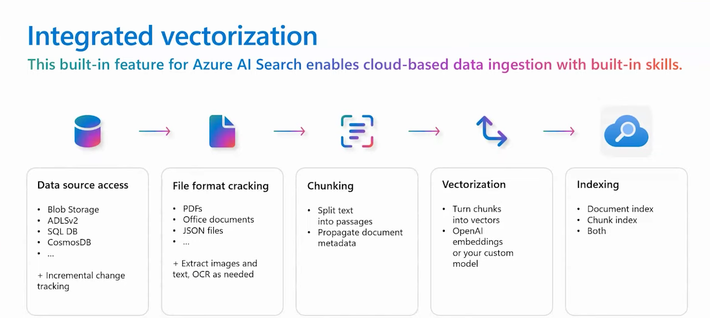
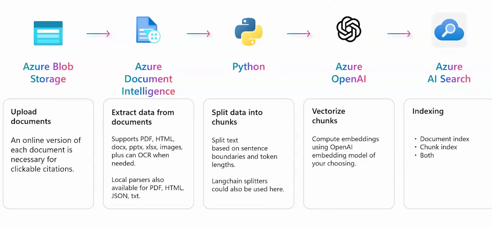
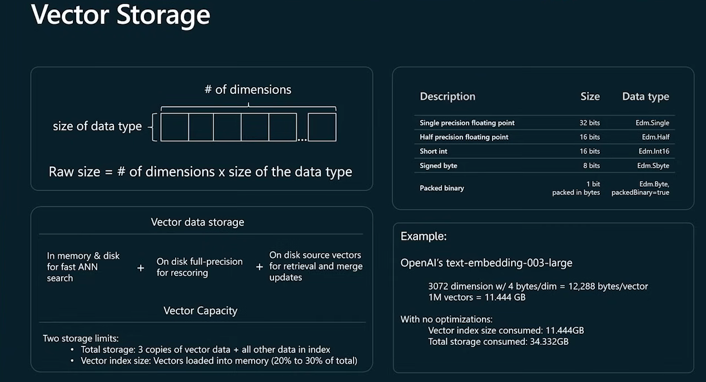
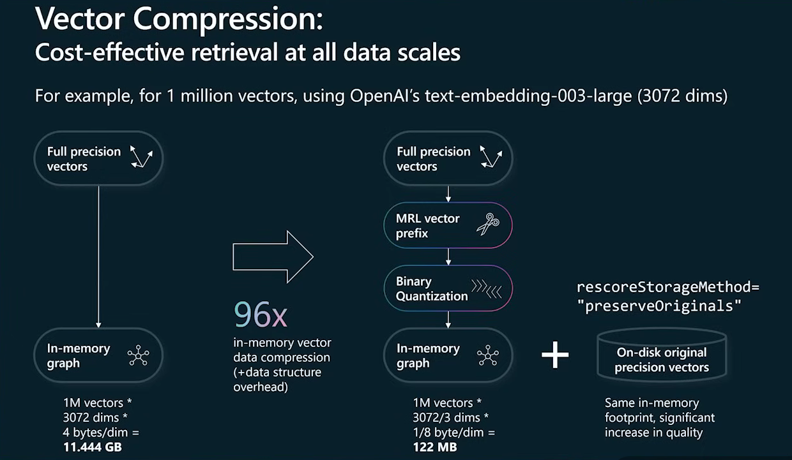

# PROJECT_AZURE_AI_SEARCH

### DATA INGESTION

### VECTOR STORAGE

### VECTOR COMPRESSION

### ENVIRONMENT VARIABLES GUIDELINE
AZURE_SEARCH_SERVICE_ENDPOINT=https://your-search-service.search.windows.net
AZURE_SEARCH_INDEX_NAME=your-index-name
AZURE_SEARCH_API_KEY=your-api-key
AZURE_OPENAI_ENDPOINT=https://your-openai-service.openai.azure.com/
AZURE_OPENAI_API_KEY=your-openai-api-key
AZURE_OPENAI_CHAT_COMPLETION_DEPLOYED_MODEL_NAME=your-deployed-model-name
AZURE_OPENAI_EMBEDDING_DEPLOYED_MODEL_NAME=your-embedding-model-name
AZURE_SEARCH_BASIC_ENDPOINT=https://your-basic-search-service.search.windows.net
AZURE_SEARCH_BASIC_API_KEY=your-basic-search-api-key
AZURE_SEARCH_BASIC_INDEX_NAME=your-basic-index-name

### Bibliography
Microsoft. (2025). RAG Time: A 5-week learning journey to mastering RAG [GitHub repository]. GitHub. https://aka.ms/rag-time